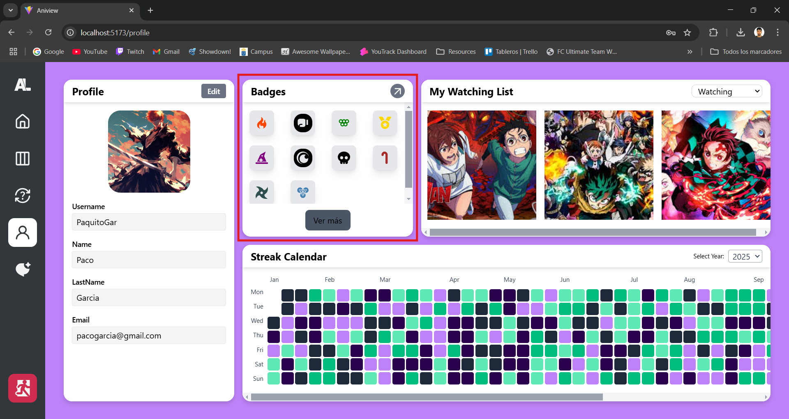
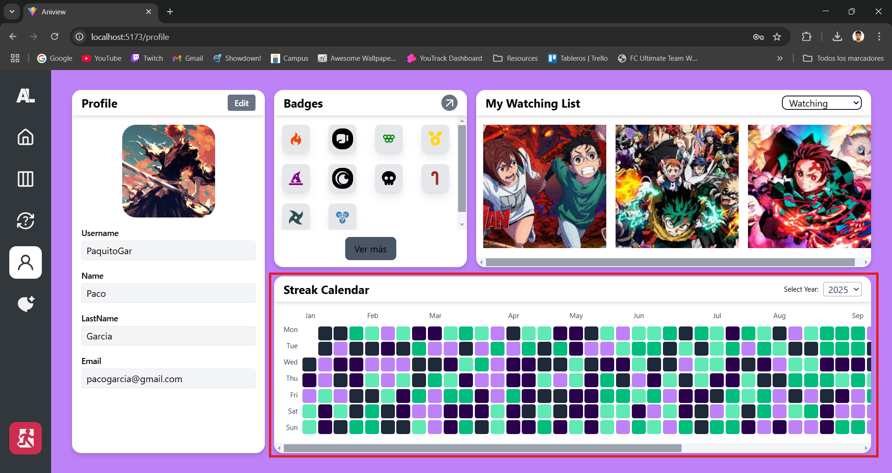
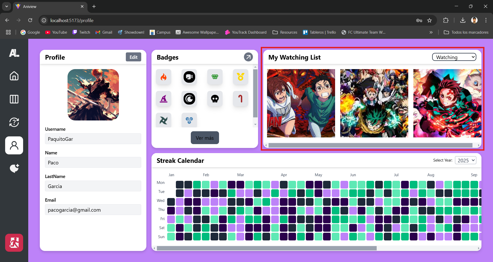
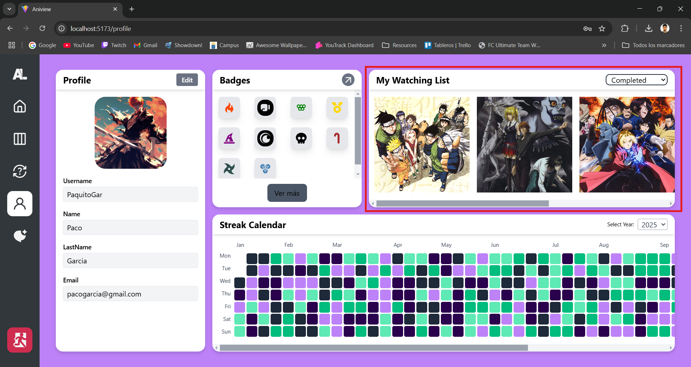
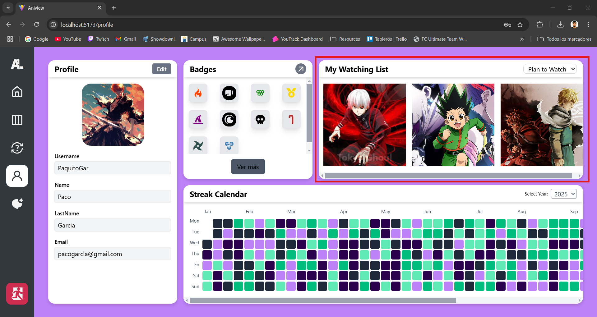

# 🎨 Personalización del perfil

AniView te permite personalizar tu perfil para reflejar tu pasión por el anime. Aquí puedes modificar tu información, hacer un seguimiento de tus logros, rachas y listas de anime.

## ✏️ Actualizar información

Editar tu perfil es muy sencillo:

1. En la sección **Profile**, puedes modificar tu información personal.
   
2. Haz clic en **Edit** y desbloquea los campos de texto para actualizar tus datos.
   
3. Rellena tus datos y dale a Lock para guardar los datos.
   

¡Personaliza tu perfil y destaca como un verdadero fanático del anime! 🎌

## 🏆 Logros y medallas

AniView te permite ganar numerosos logros y coleccionar medallas a medida que disfrutas del anime. Algunos ejemplos incluyen:

- **Maratón de Anime** 🏅: Ver 20 animes completos.
- **Veterano del Anime** 🎖️: Superar los 500 episodios vistos.
- **Coleccionista** 📀: Completar 50 animes.
- **Explorador** 🗺️: Ver animes de más de 10 géneros distintos.
- **Maratón Extrema** 🔥: Ver más de 10 episodios en un solo día.
- **Logros secretos** 🔒: Hay muchos logros ocultos que podrás desbloquear al cumplir ciertos requisitos especiales. ¡Descúbrelos!

Tus logros y medallas están visibles en la sección **Logros y Medallas** dentro de tu perfil.

## 📅 Racha de anime

El **Calendario de Racha** es una herramienta inspirada en los commits de GitHub que registra los días consecutivos en los que has agregado animes a tu lista.

Consulta tu racha en el perfil y visualiza tu progreso en el **Calendario de Racha**. ¡No rompas la cadena y mantén tu racha activa! 🔥

## 📋 Listas de anime

Administra tus listas de anime directamente desde tu perfil. Aquí puedes organizar los animes que estás viendo, los que has terminado y los que deseas ver.

En la sección **Mis Listas de Anime** encontrarás:

- Tu lista de animes en curso.
  

- Animes completados.
  

- Animes pendientes.
  

Organiza y actualiza tu lista fácilmente para llevar un control de todo lo que has visto.

---
