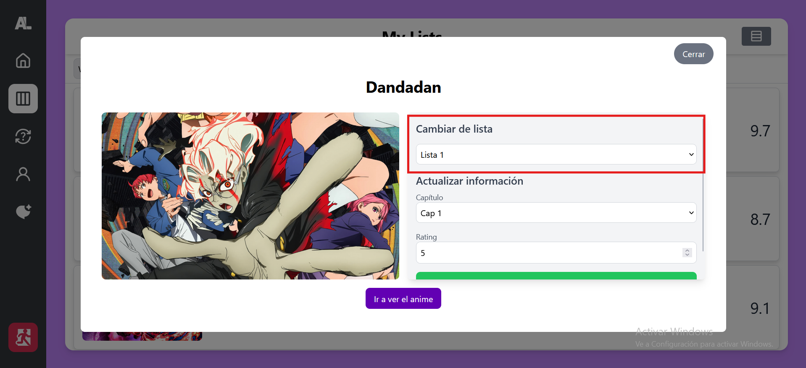
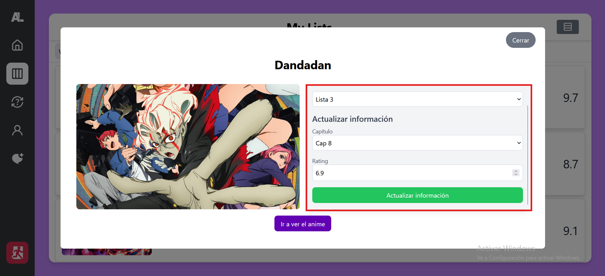

# 📋 Gestión de listas

AniView te permite gestionar listas de anime de manera eficiente. Puedes crear, editar y organizar tus listas como prefieras.

### Añadir anime a la lista

- Desde la página de detalles de cada anime, podrás añadirlo a cualquiera de tus listas.
  

### Editar los datos del anime añadido a la lista

- Desde cualquiera de nuestras listas clicamos en el anime que queramos y se nos abrira una ventana en la que podremos editar los datos de visualización del anime.
  

### Eliminar anime de la lista

- Para eliminar un anime de cualquiera de nuestras listas seguiremos los mismos pasos que para actualizar la información pero esta vez clicaremos en la opción de "Eliminar de la lista"

**En desarrollo...**
