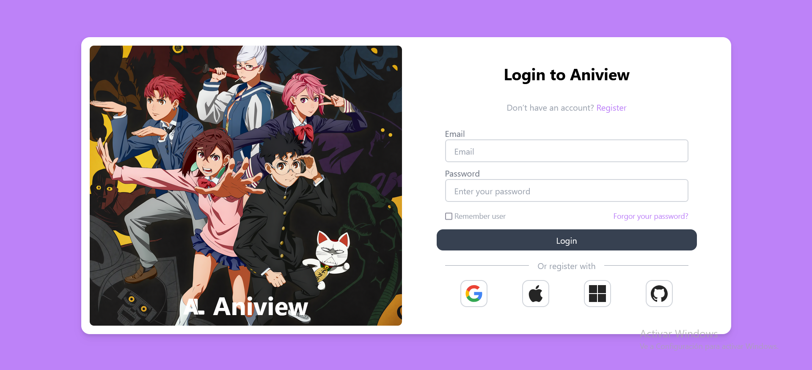
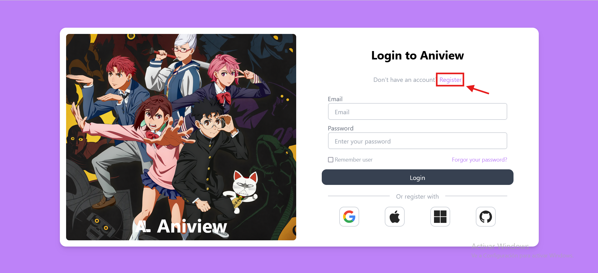
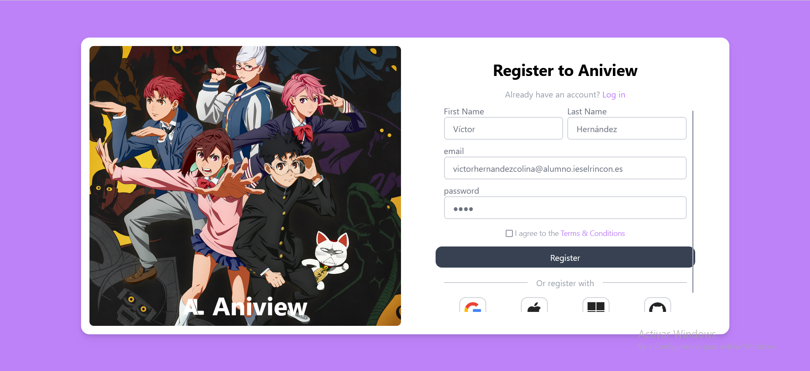
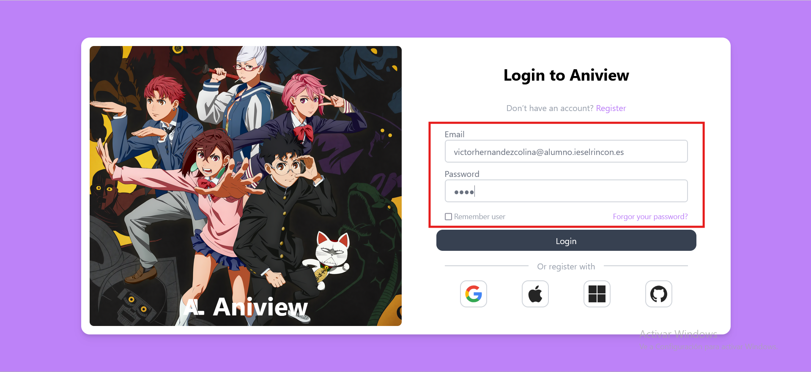

# 📝 Registro e Inicio de Sesión

Para aprovechar al máximo AniView, es importante que tengas una cuenta. Con tu cuenta podrás crear listas de animes, recibir recomendaciones personalizadas y acceder a todas las funciones de la plataforma. A continuación, te explicamos paso a paso cómo registrarte e iniciar sesión.

## 🔹 **1. Registro**

Si eres nuevo en AniView, sigue estos pasos para crear tu cuenta:

1. **Accede a la página principal**  
   Al abrir AniView por primera vez, se te pedirá que introduzcas tus credenciales para iniciar sesión.

   

2. **Crear una cuenta nueva**  
   Si aún no tienes una cuenta, haz clic en el botón **"Register"** para comenzar el proceso de registro.

   

3. **Rellenar el formulario de registro**  
   Se abrirá un formulario donde deberás ingresar información como tu nombre de usuario, correo electrónico y contraseña. Asegúrate de utilizar un correo válido, ya que podrías necesitar confirmarlo más adelante.

   

4. **Finalizar el registro**  
   Una vez completados los campos, confirma tu registro. En algunos casos, podrías recibir un correo de verificación para activar tu cuenta.

## 🔹 **2. Inicio de Sesión**

Si ya tienes una cuenta en AniView, iniciar sesión es muy sencillo:

1. **Accede con tu cuenta**  
   En la pantalla de inicio, introduce tu correo electrónico y contraseña para ingresar.

   

2. **Opciones de acceso alternativas**  
   Si prefieres, también puedes iniciar sesión mediante otras opciones disponibles, como redes sociales o cuentas vinculadas.

   

3. **¿Olvidaste tu contraseña?**  
   Si tienes problemas para acceder, puedes utilizar la opción de **"Recuperar contraseña"** para restablecer tu acceso a la cuenta.

✨ **¡Una vez dentro, ya puedes explorar AniView y disfrutar de todo su contenido!**
